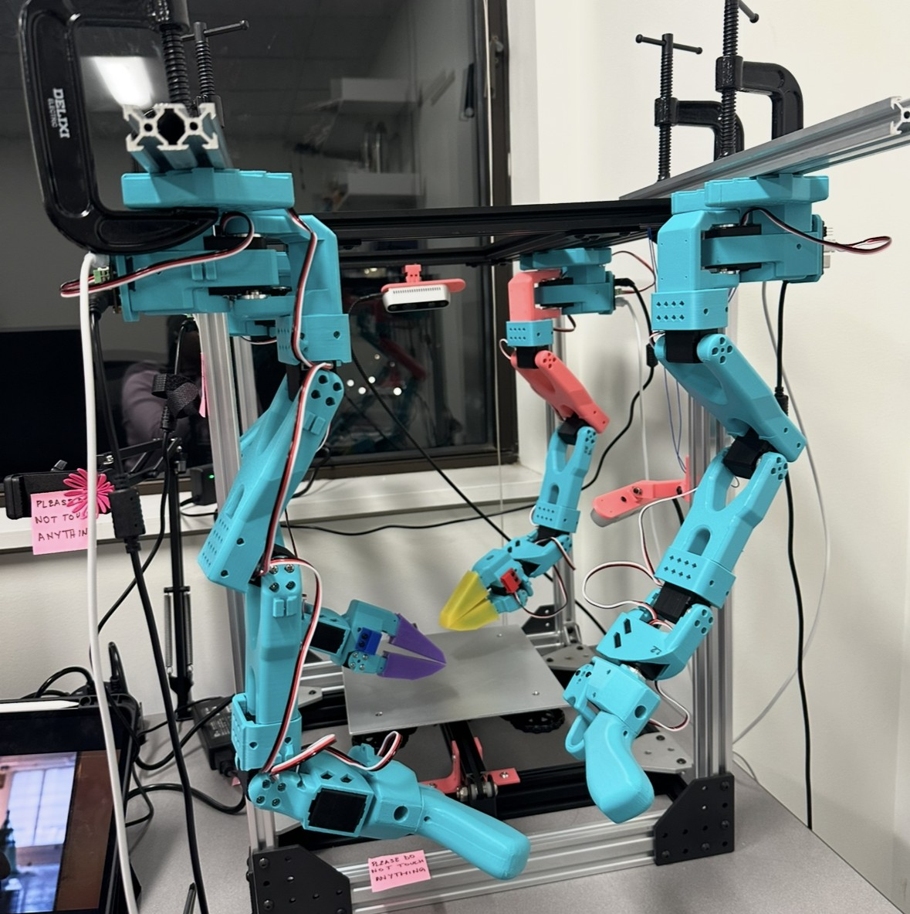

  <h1>Tabitha Oanda</h1>
  
Robotics Engineer · Fashion Designer · PhD Researcher at Brown University

  

    Cloth is deformable, slippery, and hard to track — which means off-the-shelf robot setups don't cut it. I build the full stack: a bimanual hardware platform for manipulation, multi-camera perception using foundation vision models to detect and segment fabric across frames in 3D. I use teleoperation tools that make collecting training data practical. Following data collection, I train cloth dynamics models that can be used for model predictive control (MPC) and reinforcement learning policies for complex tasks.
  

  
My research is on getting robots to handle fabric reliably. That requires building the whole stack:

  <ul class="bio-list">
    <li><strong>Platform:</strong> custom aluminum frame, overhead-mounted bimanual arms, force-sensing silicone grippers</li>
    <li><strong>Perception:</strong> multi-camera RGB-D, object detection and segmentation, 3D point tracking</li>
    <li><strong>Data collection:</strong> leader-follower teleoperation for imitation learning, custom <a href="https://umi-gripper.github.io/">UMI-inspired</a> data collection gripper</li>
    <li><strong>Learning:</strong> cloth dynamics models trained and extended on data from my custom setup</li>
  </ul>

  

    
  

  

    <video autoplay muted loop playsinline>
      <source src="assets/videos/sew-unit-mirror-bimanual.mp4" type="video/mp4">
    </video>
    
Real robot executing a planned bimanual cloth manipulation trajectory.

  

<h2 id="projects">Projects</h2>

  <a class="project-card" href="projects/sew-unit">
    <h3>The Sew Unit</h3>
    
A bimanual cloth manipulation platform built from scratch: custom aluminum frame, SO-101 arms, MoveIt planning, and leader-follower teleoperation. All designed, built, and debugged by hand.

    View project →
  </a>

  <a class="project-card" href="projects/cloth-dynamics">
    <h3>Learning Cloth Dynamics</h3>
    
Ran PhysTwin and PGND on cloth data I collected, built the full perception and data pipeline, then explored whether adding visual supervision to dynamics training improves 3D predictions. Results are promising on individual fabrics; active research.

    View project →
  </a>

  <a class="project-card" href="projects/grippers">
    <h3>Custom Grippers &amp; Teleop Tools</h3>
    
Designed two custom end-effectors: silicone FSR grippers for contact-aware grasping, and a UMI-inspired handheld teleop gripper with ArUco markers and IMU for data collection.

    View project →
  </a>

