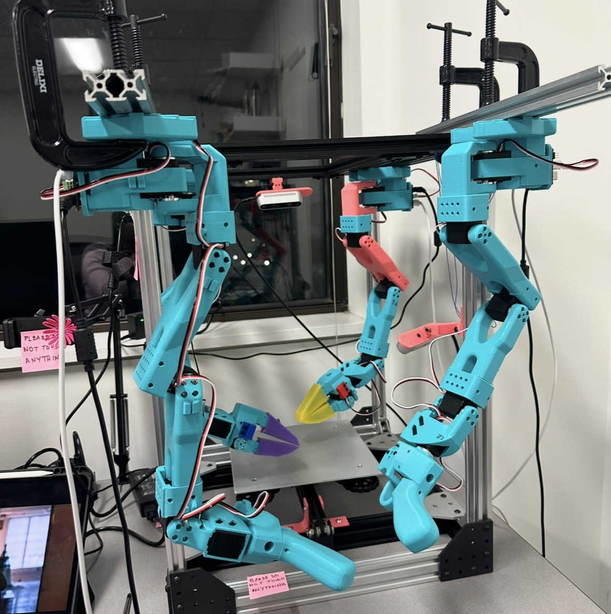
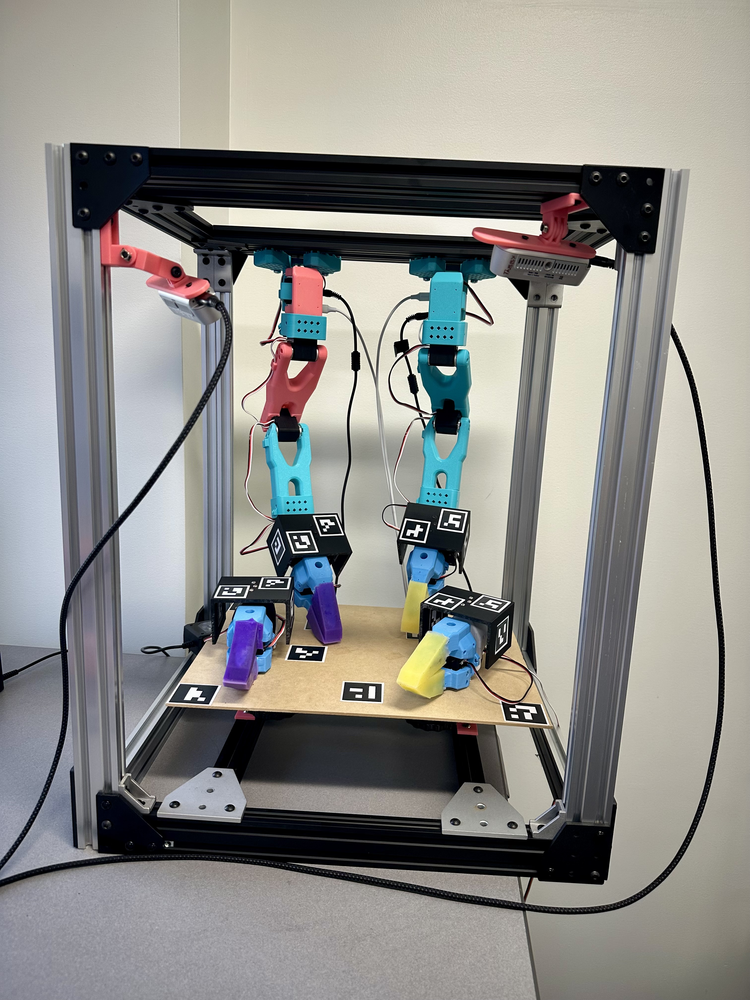
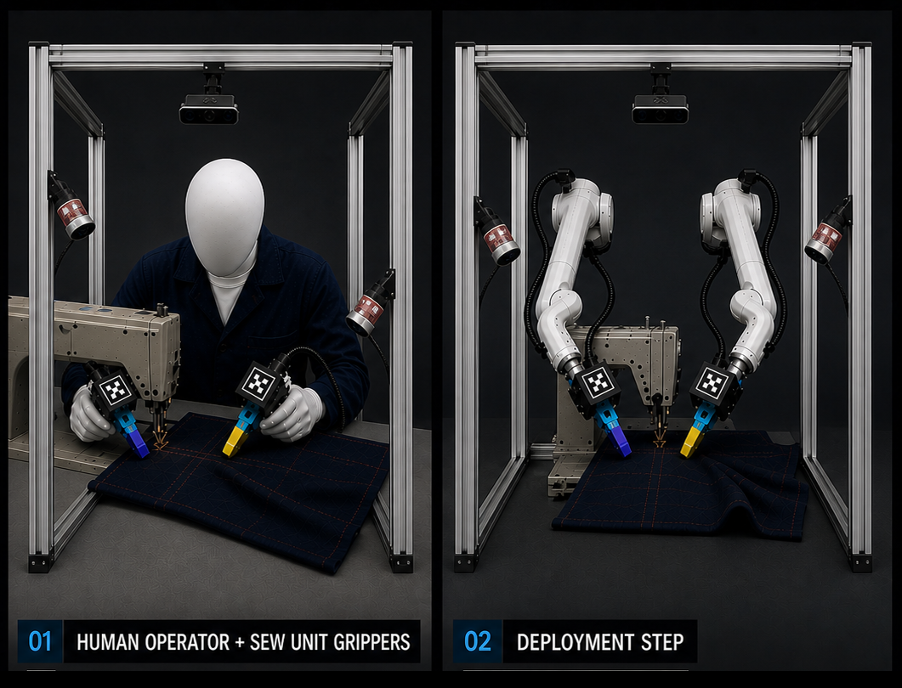
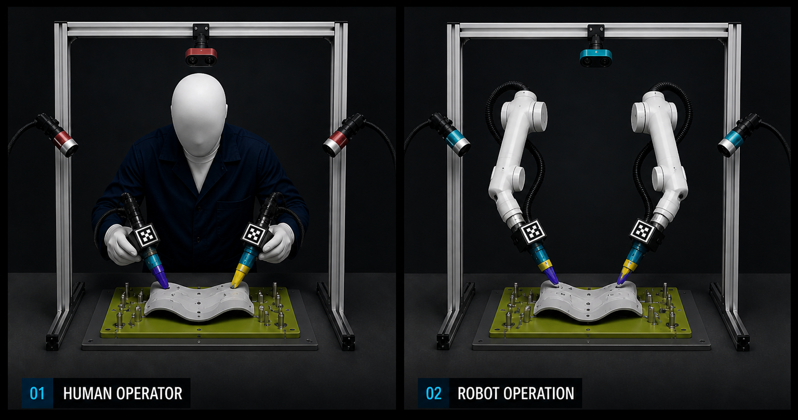
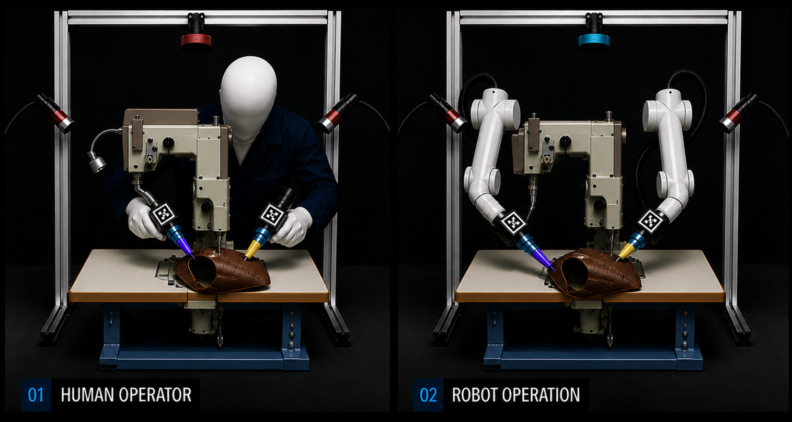
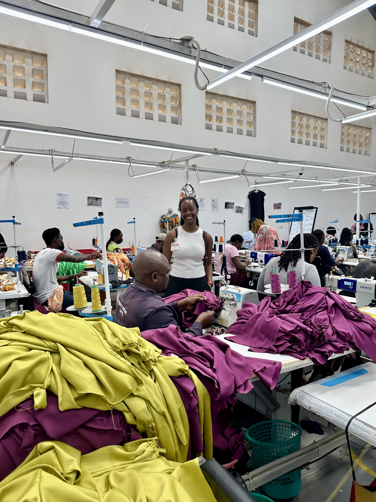
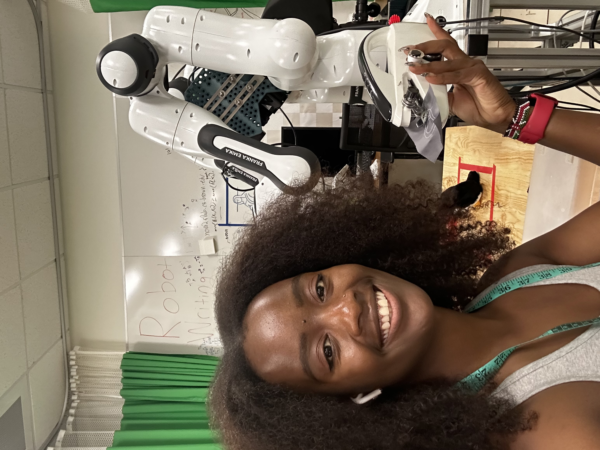
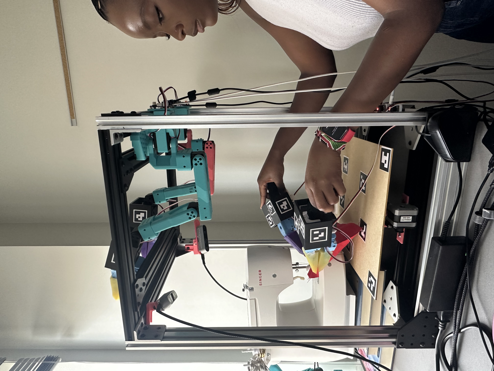

  <h1>Tabitha Oanda</h1>
  
Robotics Engineer · Fashion Designer · PhD Researcher at Brown University

  

    Cloth is deformable, slippery, and hard to track — which means off-the-shelf robot setups don't cut it. I build the full stack: a bimanual hardware platform for manipulation, multi-camera perception using foundation vision models to detect and segment fabric across frames in 3D. I use teleoperation tools that make collecting training data practical. Following data collection, I train cloth dynamics models that can be used for model predictive control (MPC) and reinforcement learning policies for complex tasks.
  

  
My research is on getting robots to handle fabric reliably. That requires building the whole stack:

  <ul class="bio-list">
    <li><strong>Platform:</strong> custom aluminum frame, overhead-mounted bimanual arms, force-sensing silicone grippers</li>
    <li><strong>Perception:</strong> multi-camera RGB-D, object detection and segmentation, 3D point tracking</li>
    <li><strong>Data collection:</strong> leader-follower teleoperation for imitation learning, custom <a href="https://umi-gripper.github.io/">UMI-inspired</a> data collection gripper</li>
    <li><strong>Learning:</strong> cloth dynamics models trained and extended on data from my custom setup</li>
  </ul>

  
A consistent theme in my research is taking methods developed in academic settings and adapting them to work on real cloth manipulation problems — the kind of contact-rich, deformable-object tasks that matter for industrial textile handling.

  

    
    
Initial assembly with leader arms for teleoperation.

  

  

    <video autoplay muted loop playsinline>
      <source src="assets/videos/multi-fold.mp4" type="video/mp4">
    </video>
    
Single arm fold policy in action.

  

<h2 id="projects">Projects</h2>

  <a class="project-card" href="projects/sew-unit">
    <h3>The Sew Unit</h3>
    
A bimanual cloth manipulation platform built from scratch: custom aluminum frame, SO-101 arms, MoveIt planning, and leader-follower teleoperation. All designed, built, and debugged by hand.

    View project →
  </a>

  <a class="project-card" href="projects/cloth-dynamics">
    <h3>Learning Cloth Dynamics</h3>
    
Ran PhysTwin and PGND on cloth data I collected, built the full perception and data pipeline, then explored whether adding visual supervision to dynamics training improves 3D predictions. Results are promising on individual fabrics; active research.

    View project →
  </a>

<h2 id="applied-research">Applied Research: Sew Unit</h2>

Most textile automation targets a single operation on a single fabric type. The Sew Unit is designed to be a general-purpose robotic worker for 3D textile assembly — bimanual manipulation, learned from human demonstrations, deployable where an operator stands today. The platform I built for research is the foundation for a system that learns new sewing operations without reprogramming.

  

    
    
Current physical setup — approx. 24×20×18 in (prototype).

  

  

    
    
From human operator to autonomous deployment. <em>AI-generated concept.</em>

  

  

    
    
Fitting textile panels into jigs. <em>AI-generated concept.</em>

  

  

    
    
Shoe upper sewing. <em>AI-generated concept.</em>

  

<h2 id="why-me">Why Me</h2>

I'm a fashion designer with direct experience commissioning contract manufacturers and a robotics researcher who builds full stacks from the ground up: mechanical design, fabrication, electronics, and machine learning.

  

    
    
Visiting an apparel factory in Kenya.

  

  

    
    
With a Franka arm and a handheld sewing machine.

  

  

    
    
Collecting sewing demonstrations with handheld grippers.

  

