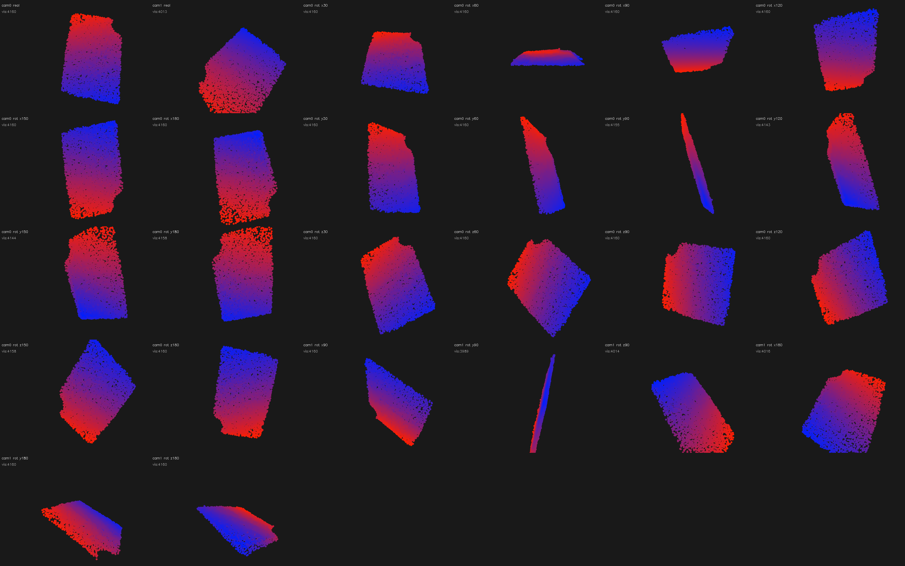
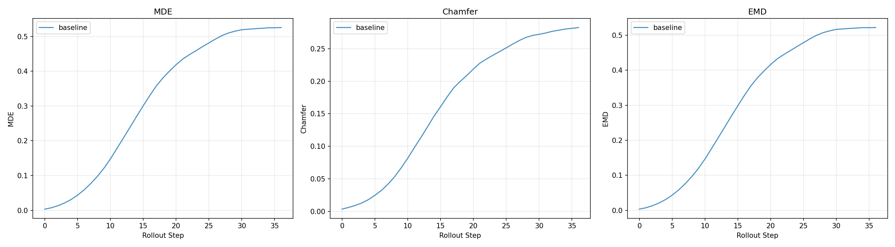

<a href="../" class="back-link">← Back to Home</a>

  <h1>Learning Cloth Dynamics</h1>
  
Two parallel threads: building a custom cloth manipulation dataset using PhysTwin on the sew unit, and running PGND on their data while experimenting with different training mechanisms, including photometric render loss and live camera conditioning at rollout time.

---

## Part 1: PhysTwin — Custom Cloth Data

I used PhysTwin to simulate and record cloth manipulation trajectories with the sew unit's bimanual setup. PhysTwin fits a particle-based simulation to real cloth by optimizing physical parameters (stiffness, damping, mass) directly from observed RGB-D sequences, so the simulated cloth behaves like the actual fabric being manipulated. That required building a multi-camera perception pipeline to turn raw RGB-D video into the 3D particle tracks PhysTwin trains on.

### Perception Infrastructure

<ul class="spec-list">
  <li><strong>Cameras:</strong> 4× Intel RealSense (D435i and D405) around the workspace</li>
  <li><strong>Calibration:</strong> ChAruco boards (DICT_4X4_50, 5×4, 40mm squares); best stereo pair: 0.68 RMS reprojection error. Automated hand-eye calibration for camera-to-robot-base transforms.</li>
  <li><strong>Cloth segmentation:</strong> Custom YOLOv5 models trained on hand-annotated images (~500 epochs each), separate detector per fabric type (black, denim, red), annotated in labelImg with standard train/val/test splits</li>
  <li><strong>Gripper tracking:</strong> Started with HSV color thresholding, replaced with CoTracker 3 (Meta's learned point tracker) for robustness under changing lighting and occlusion</li>
  <li><strong>Dataset:</strong> 11 annotated manipulation trajectories across black, denim, and red fabric; single-arm and dual-arm motions recorded at 3–30 Hz</li>
</ul>

  
  
Point cloud tracking grid: reconstructed cloth state from calibrated multi-camera setup across multiple trajectories.

### Simulation Rollouts

Getting PhysTwin running on custom data required writing the full conversion pipeline: raw SO-101 teleop recordings → YOLO-masked particle tracks → CMA-ES spring parameter optimization → warp simulator training (200 iterations). Key issues: controller points needed to be within 1 cm of the cloth surface to couple properly, and single-gripper motions required manual spring softening (Y=1000) vs. the dual-gripper optimum (Y≈75k) for realistic drape.

This is the training trajectory: the sequence PhysTwin is optimized on. The particle-based simulator is fit to this real cloth episode, learning stiffness and damping parameters that reproduce the observed deformation.

  <video autoplay muted loop playsinline>
    <source src="../assets/videos/cloth-dynamics-inference.mp4" type="video/mp4">
  </video>
  
Training trajectory: particle-based cloth simulation rolling out on the real episode PhysTwin was fit to.

After fitting, the simulation is validated against held-out camera views. Each wide video below shows three panels side by side: real RGB, reconstructed point cloud, and PhysTwin prediction.

  <video autoplay muted loop playsinline>
    <source src="../assets/videos/cloth-dynamics-triptych-cam0.mp4" type="video/mp4">
  </video>
  
Camera 0: real RGB | point cloud reconstruction | PhysTwin prediction.

  <video autoplay muted loop playsinline>
    <source src="../assets/videos/cloth-dynamics-triptych-cam1.mp4" type="video/mp4">
  </video>
  
Camera 1: same validation sequence from the second viewpoint.

Once the physical parameters are learned from a single training trajectory, the simulator generalises to novel actions. These bimanual sequences were entirely out-of-distribution (the model trained on observed push/slide motions, not folds or stretches). Motions tested: both grippers lift simultaneously, fold right over left, fold left over right, pull apart, twist in opposite directions, lift then stretch. The spring dynamics and gravity learned from one trajectory produce plausible cloth behaviour across all of them.

  <video autoplay muted loop playsinline>
    <source src="../assets/videos/sew-unit-dual-pull-apart.mp4" type="video/mp4">
  </video>
  
Novel action: bimanual pull-apart. Stretching cloth from both ends with PhysTwin learned parameters.

  <video autoplay muted loop playsinline>
    <source src="../assets/videos/cloth-dynamics-fold-l-over-r-v2.mp4" type="video/mp4">
  </video>
  
Novel action: fold left over right — draping one side of the cloth across the other.

  <video autoplay muted loop playsinline>
    <source src="../assets/videos/sew-unit-dual-push-together.mp4" type="video/mp4">
  </video>
  
Novel action: bimanual push-together. Both arms pushing cloth toward the center.

---

## Part 2: PGND — Training Mechanism Experiments

I took Particle-Grid Neural Dynamics (PGND), a state-of-the-art method for learning deformable object models from RGB-D video, ran it on 80 training and 40 held-out evaluation episodes from my own robot, and explored whether adding visual supervision during training can improve dynamics predictions. This is active research; the results are mixed and honest framing matters here.

The core question: every existing cloth dynamics method trains on 3D particle positions only, using rendering purely for visualization. Can closing the loop by using RGB images as a training signal improve 3D prediction?

### The Three Models

**Baseline (100k)** trains on particle position loss (`loss_x`, MSE per step) alone with no visual signal. This is the benchmark all variants compare against. On 40 held-out episodes: MDE 0.451, Chamfer 0.233, EMD 0.447.

**Phase 2 (40k)** adds a differentiable render loss with a frozen neural mesh renderer: `λ_render = 0.1` (DINOv2 feature distance) + `λ_ssim = 0.2` (SSIM). The key insight over earlier ablations was decoupling renderer training from dynamics training: train the renderer to convergence first, then finetune the dynamics model against it. Joint training (tested first) was unstable; the frozen renderer approach showed 15–32% MDE improvement on individual fabric types. Gains were inconsistent across all 40 evaluation episodes and sensitive to λ (values above 0.4 destabilize dynamics). A fundamental limitation: single-camera render loss can't distinguish "correct 3D" from "looks right from one angle."

**Visual PGND (70k)** replaces the LBS-based renderer with mesh-constrained Gaussian Splatting, with each Gaussian bound directly to a mesh face, removing an approximation error that blurred the render loss gradient. Also adds camera conditioning at rollout via a frozen DINOv2 backbone, so the model can see when predictions drift and self-correct. Still training at time of writing.

All three share the same particle-grid simulator core (80 training episodes, indices 162–241) and are evaluated on 40 held-out episodes (indices 610–650), rolling out 30 steps autoregressively from ground truth initial conditions.

### Model Comparison — Episode 0201

The same cloth manipulation rollout predicted by each model. Watch how prediction quality changes as each additional supervisory signal is added.

  <video autoplay muted loop playsinline>
    <source src="../assets/videos/pgnd-ep0201-baseline.mp4" type="video/mp4">
  </video>
  
Baseline (100k): geometry only, no visual signal

  <video autoplay muted loop playsinline>
    <source src="../assets/videos/pgnd-ep0201-phase2.mp4" type="video/mp4">
  </video>
  
Phase 2 (40k): + DINOv2 render loss + SSIM during training

  <video autoplay muted loop playsinline>
    <source src="../assets/videos/pgnd-ep0201-visual.mp4" type="video/mp4">
  </video>
  
Visual PGND (70k): + mesh-constrained GS + camera conditioning at rollout

  <video autoplay muted loop playsinline>
    <source src="../assets/videos/pgnd-comparison-all.mp4" type="video/mp4">
  </video>
  
All episodes: baseline vs. visual PGND across the full held-out eval set.

### Evaluation Metrics

  
  
Prediction error over 30 rollout steps across all three models. Lower is better; all metrics grow with rollout horizon as compounding errors accumulate.

Three distance metrics, each measuring a different aspect of prediction quality:

- **MDE (Mean Displacement Error):** average Euclidean distance between each predicted particle and its ground truth counterpart, averaged over all particles at each rollout step. Sensitive to per-particle drift.
- **Chamfer Distance:** bidirectional nearest-neighbour distance. For each predicted particle find the closest GT particle and vice versa, then sum both directions. Penalises large-scale shape mismatch without requiring correspondence.
- **EMD (Earth Mover's Distance):** minimum total work to transport the predicted point cloud to match the GT distribution. More sensitive than Chamfer to spread-out errors and global cloth deformation failure modes.

Training also tracks `loss_x` (the MSE position loss, primary signal for all models) and `loss_render` (DINOv2 + SSIM render error, Phase 2 and Visual only).

---

## What I Learned

  
<strong>The perception pipeline is where the real work is.</strong> Getting CoTracker running reliably on my specific cameras, lighting, and occlusion patterns required more iteration than training the dynamics model. Data quality limits everything downstream.

  
<strong>Joint training with a crude renderer is worse than no render loss at all.</strong> The first ablation (LBS-based renderer trained jointly with dynamics) produced 16× worse MDE than baseline. A better renderer helps, but decoupling renderer training from dynamics finetuning was the key architectural decision that made render loss viable at all.

  
<strong>Evaluation set size matters more than you expect.</strong> A 5-episode eval showed a 20% improvement from visual conditioning. A 40-episode eval showed ~1%. The 5-episode result was episode selection bias. The 40-episode numbers are the ones I report.

  
<strong>Single-camera render loss has a fundamental ambiguity.</strong> The model can satisfy the 2D render loss by producing cloth that looks correct from one angle but is wrong in 3D. Multi-camera rendering should help; it's the next step.

---

<a href="../" class="back-link">← Back to Home</a>
