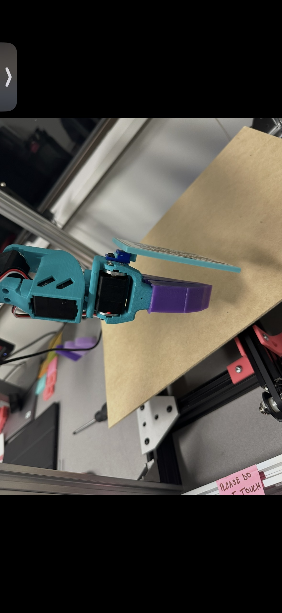

<a href="../" class="back-link">← Back to Home</a>

  <h1>Force-Sensing Silicone Grippers</h1>
  
Custom silicone gripper tips with embedded FSR (force-sensitive resistor) sensors for contact-aware cloth manipulation.

## Design

The grippers are cast in silicone using custom-designed moulds. Silicone compliance gives a larger contact patch than rigid 3D-printed fingers, which matters a lot when you're gripping fabric — more contact area means less slipping.

FSR sensors are embedded inside the silicone fingertips. The force signal feeds back to the controller to modulate grip pressure in real time.

  
  
Gripper with cast silicone tip — the purple section is the silicone fingertip with embedded FSR sensor.

<!-- Schematic of FSR wiring and signal conditioning circuit — to be added -->
<!-- Photos of silicone moulds — to be added -->

## Grasp Comparison

**Without FSR feedback:** The gripper closes to a fixed position regardless of what it's holding. Works on some fabrics, slips on others, and bunches delicate materials.

**With FSR feedback:** The gripper closes until it hits a target force threshold, then holds. Consistent grasp across different fabric weights and thicknesses — from silk to denim.

<!-- Video: grasp with vs without force feedback — to be added -->

## What I Learned

  
<strong>Silicone casting: degassing matters more than you think.</strong> Trapped air bubbles create weak spots right where the FSR sits. A vacuum chamber before curing made a big difference in sensor reliability.

  
<strong>FSR placement is a balancing act.</strong> Too deep in the silicone and the signal is damped to the point of uselessness. Too shallow and the sensor pokes through the surface after a few hundred grasps.

  
<strong>Simple force threshold works.</strong> I initially planned more sophisticated impedance control, but a straightforward threshold-based approach turned out to be effective for all the fabric manipulation tasks I tested. Sometimes the simple thing is the right thing.

---

<a href="../" class="back-link">← Back to Home</a>
