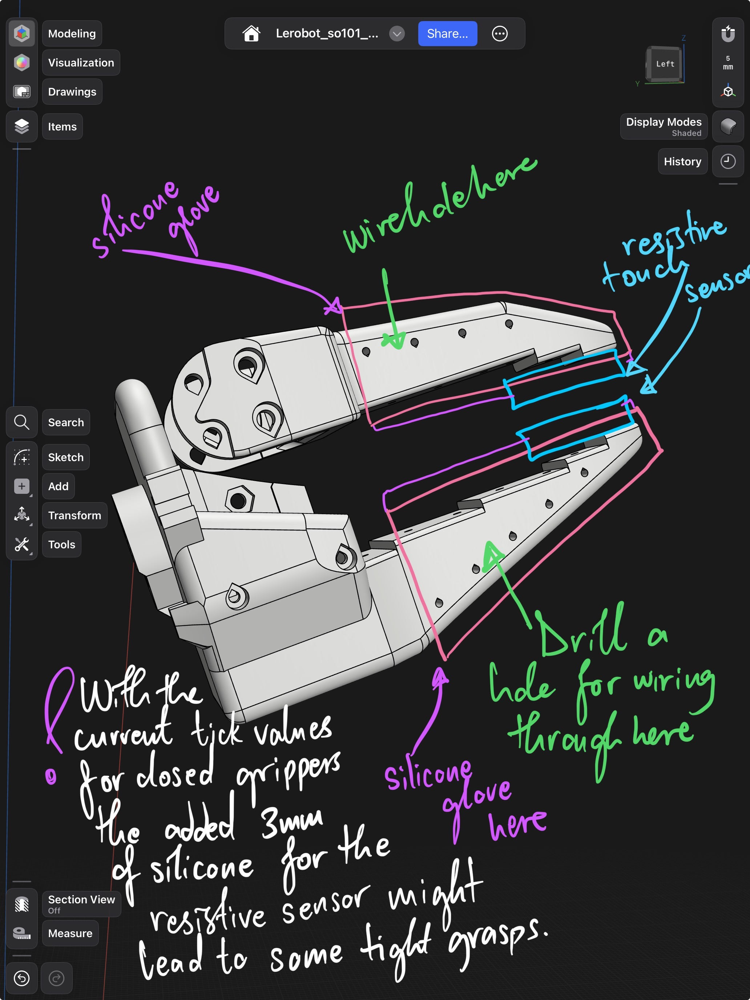
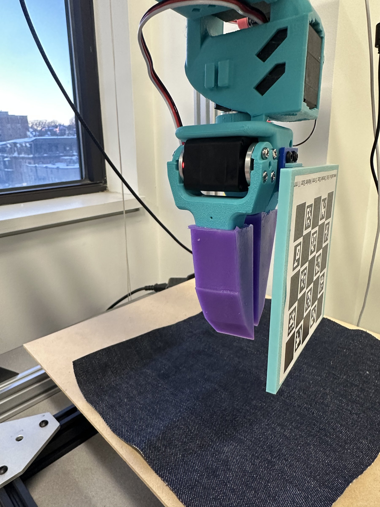
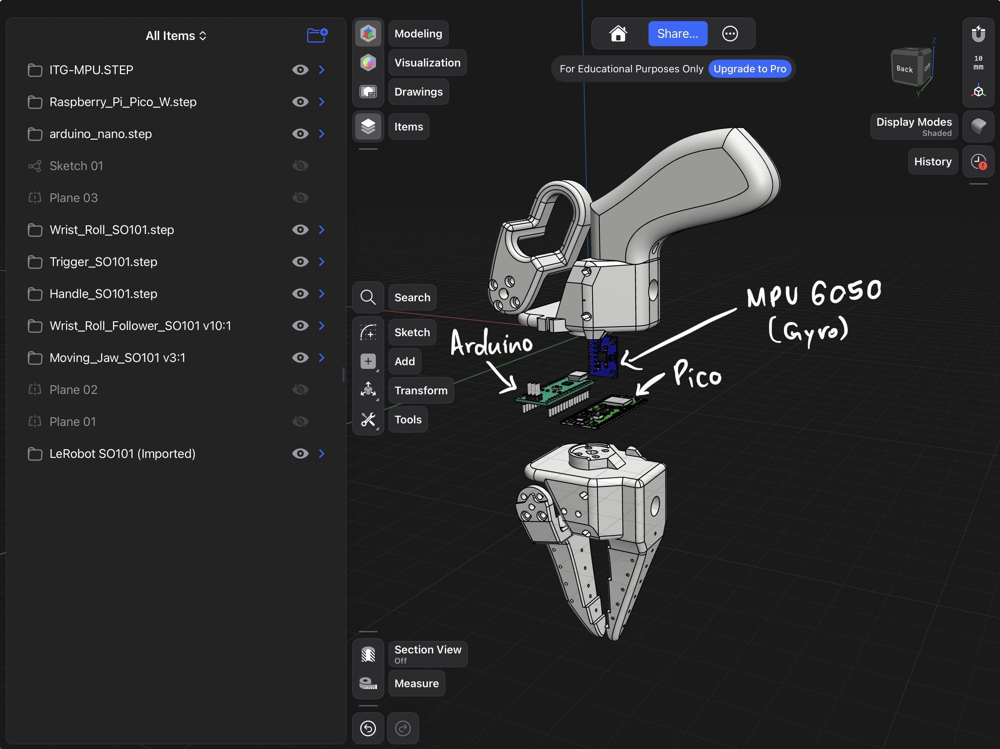
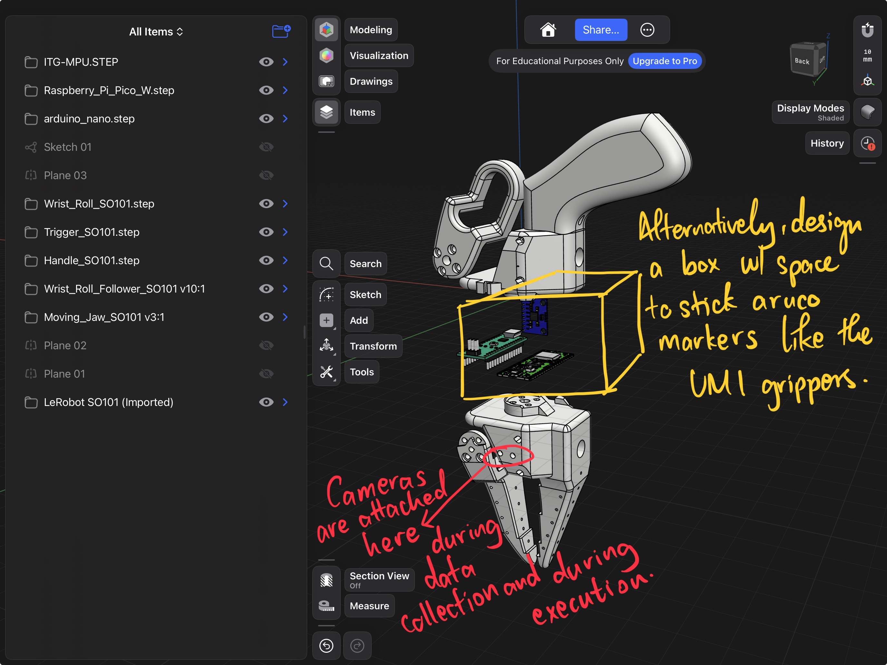
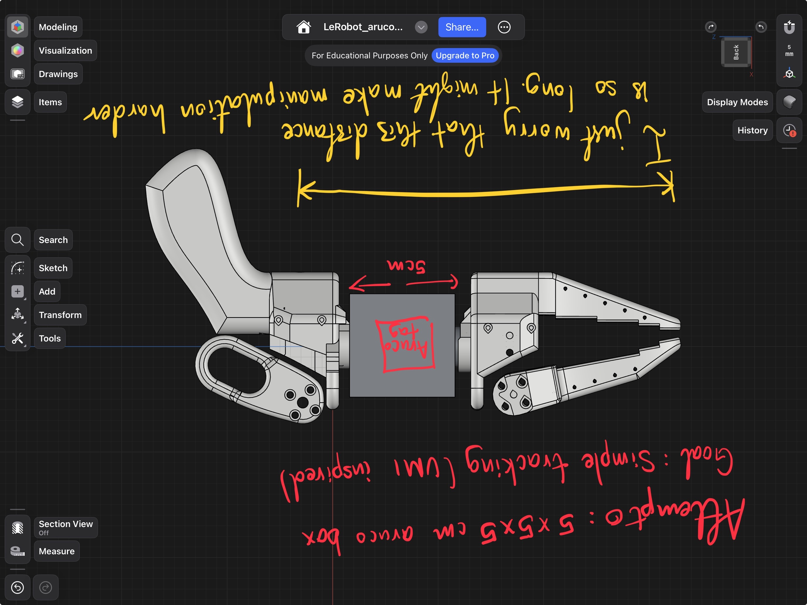
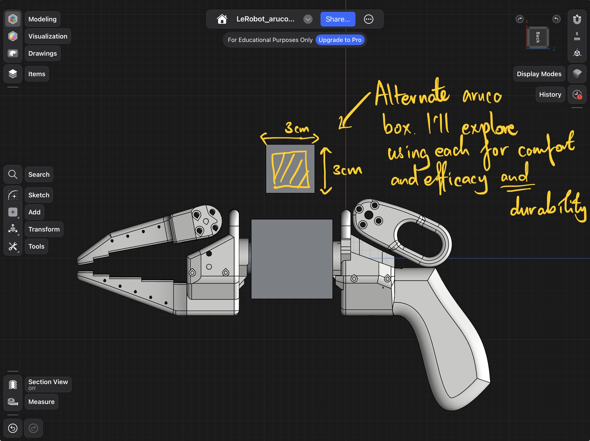
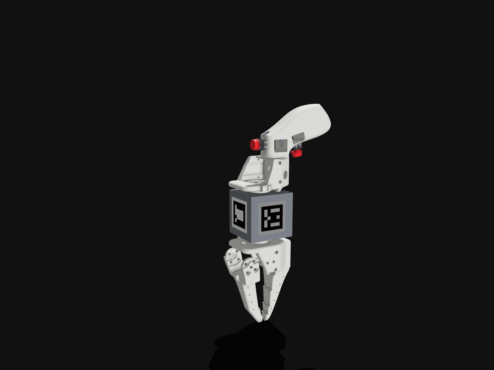
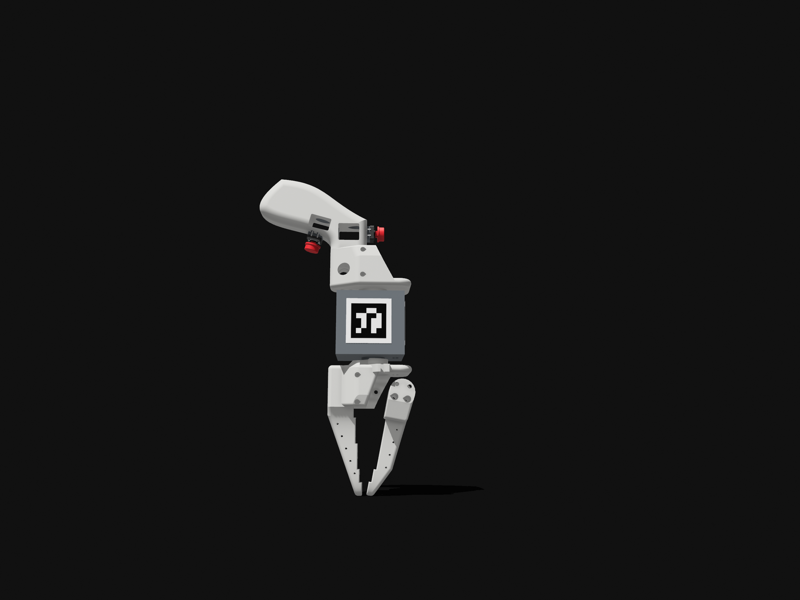

<a href="../" class="back-link">← Back to Home</a>

  <h1>Custom Grippers &amp; Teleop Tools</h1>
  
Two custom end-effectors designed for cloth manipulation: silicone FSR grippers for contact-aware grasping, and a UMI-inspired handheld teleoperation gripper with ArUco markers and IMU for imitation learning data collection.

---

## Part 1: Force-Sensing Silicone Grippers

The default SO-101 grippers work fine on rigid objects. On fabric, they either slip or bunch the material. The fix: cast custom silicone fingertips with embedded FSR sensors so the gripper knows when it's actually holding something.

  

    
    
Design in Shapr3D — annotated with wire routing, sensor placement, and silicone casting notes.

  

  

    
    
Physical gripper with cast silicone tip and ChAruco board for hand-eye calibration — denim on the workspace below.

  

  <video autoplay muted loop playsinline>
    <source src="../assets/videos/sew-unit-denim-pinch.mp4" type="video/mp4">
  </video>
  
Denim pinch — the silicone tip gripping denim fabric.

### Design

- Moulds designed to cast silicone fingertips that conform to fabric surfaces
- FSR sensors embedded inside the silicone; signal feeds to controller to modulate grip pressure
- Silicone compliance gives a larger contact patch than rigid 3D-printed fingers

### Grasp Comparison

**Without FSR:** Gripper closes to a fixed position. Works on some fabrics, slips on others, bunches delicate material.

**With FSR:** Closes until force threshold, then holds. Consistent grasp across fabric weights and thicknesses, from silk to denim.

  
<strong>Degassing silicone matters more than you think.</strong> Trapped air bubbles create weak spots right where the FSR sits. A vacuum chamber before curing made a big difference in sensor reliability.

  
<strong>FSR placement is a balancing act.</strong> Too deep in the silicone and the signal is damped to uselessness. Too shallow and it pokes through after a few hundred grasps.

---

## Part 2: UMI-Inspired Teleop Gripper

For collecting imitation learning data, I wanted something better than just moving the leader arms. This is a handheld teleoperation gripper inspired by Stanford's UMI system, adapted for the LeRobot SO-101 platform and STS/SCS servo protocol.

The design uses ArUco markers on a mounted box for camera-based pose estimation during data collection, plus an IMU for orientation, similar to how UMI tracks gripper pose without a wrist camera on the follower side.

  

    
    
Electronics layout — Arduino, Pico, MPU6050 (gyro), annotated during design.

  

  

    
    
ArUco box and camera mount — "cameras attached here during data collection and execution."

  

  

    
    
First iteration — 5×5×5 cm ArUco box, measuring the arm length tradeoffs.

  

  

    
    
Second iteration — alternate ArUco box geometry, exploring comfort, efficacy, and durability.

  

  <video autoplay muted loop playsinline>
    <source src="../assets/videos/gripper-teleop-cad-spin.mp4" type="video/mp4">
  </video>
  
3D model spin — final teleop gripper design with ArUco box mounted.

  

    
  

  

    
  

### How it Works

1. Operator holds the gripper and squeezes the trigger
2. Trigger position read by potentiometer → Arduino → SO-101 controller over serial
3. IMU tracks wrist orientation
4. Same serial bus carries arm joint positions from the leader arm
5. Synchronized at 30 Hz with multi-camera frames from the sew unit

Two gripper actuation approaches were prototyped. One version uses a thumb-actuated trigger (servo-based, serially communicating with the follower). The other (visible as the red buttons in the design iteration images) uses physical push buttons instead, removing the need for a second servo in the communication chain. Both approaches are compatible with the same ArUco tracking and IMU pipeline.

### What's Different from the Original UMI

| | Original UMI | This Version |
|---|---|---|
| **Platform** | Franka / UR5 | SO-101 / LeRobot |
| **Communication** | Dynamixel / ROS topics | STS/SCS half-duplex serial |
| **Pose tracking** | Wrist-mounted camera | ArUco + IMU |

---

<a href="../" class="back-link">← Back to Home</a>
