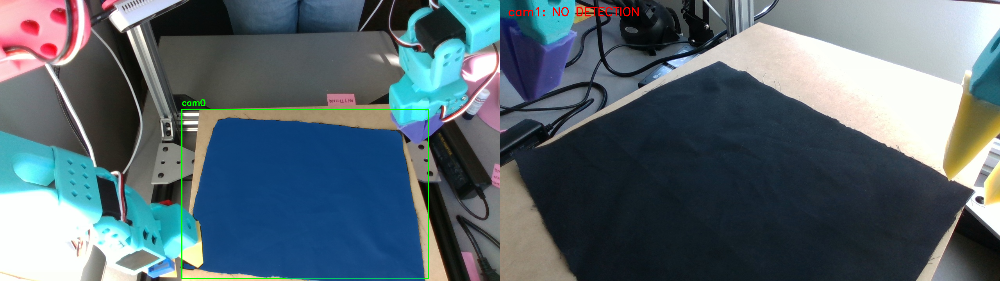
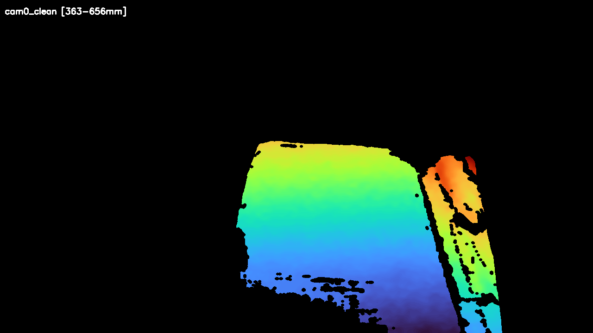
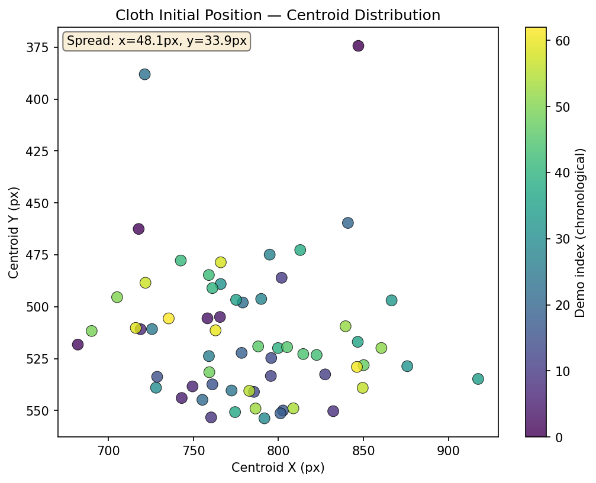
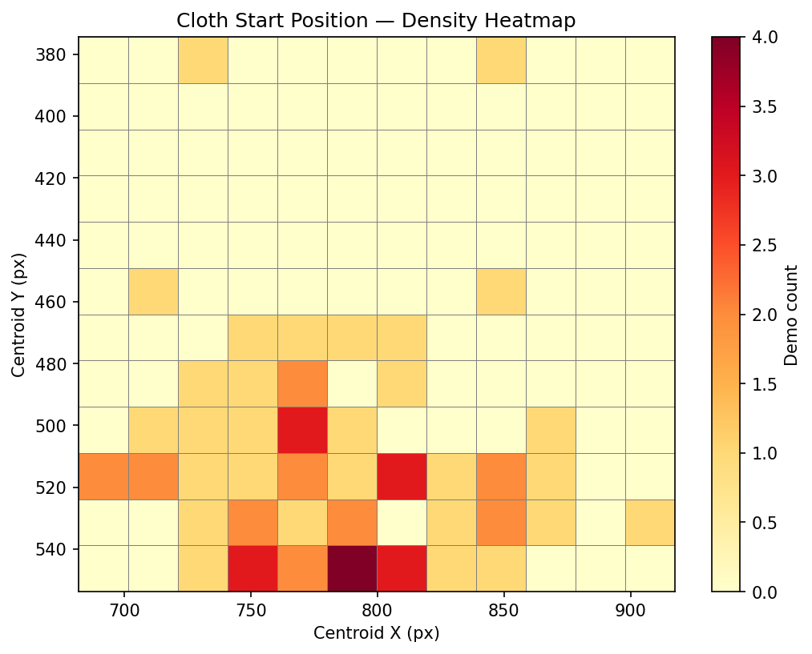
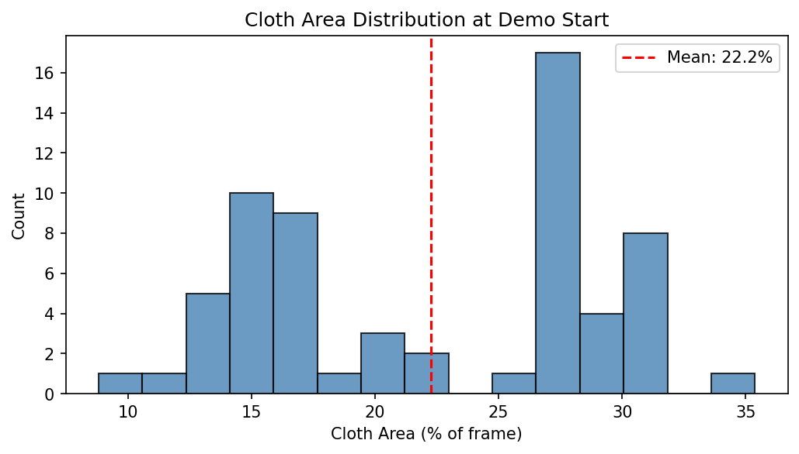
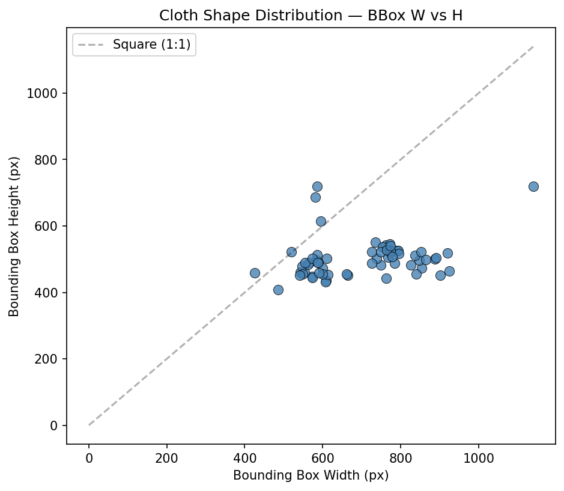
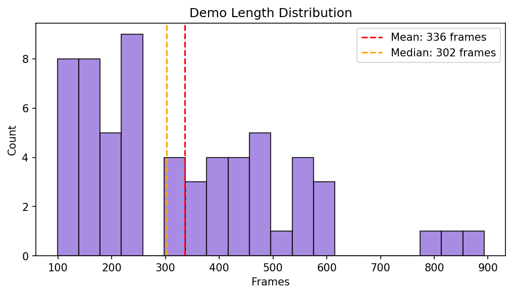
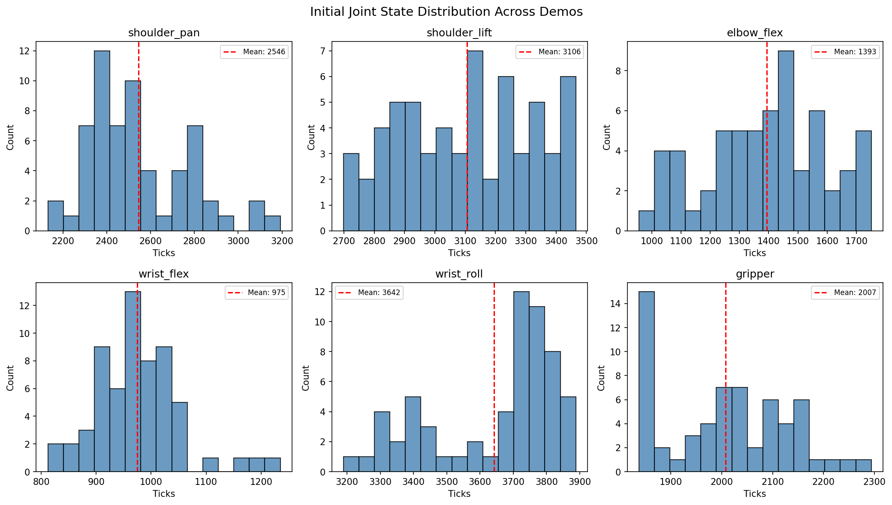
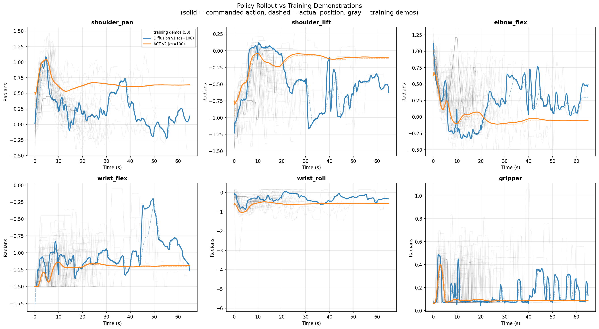
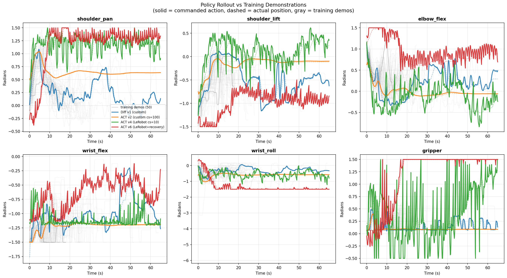

<a href="../" class="back-link">← Back to Home</a>

  <h1>Policy Training</h1>
  
Training visuomotor policies for autonomous cloth folding on the SO-101 platform. Single-arm folding using ACT (Action Chunking with Transformers) with imitation learning from teleoperated demonstrations — 267 demos, 15+ models trained, and a best deployment success rate of 40–60%.

---

## Task & Setup

The goal is a policy that autonomously folds a cloth using the **left arm** of the SO-101 dual-arm robot. The robot observes the scene through two fixed Intel RealSense cameras, receives joint state feedback, and outputs target joint positions at 10 Hz.

| | |
|---|---|
| **Task** | Single-arm cloth folding (left arm, 6 DOF + gripper) |
| **Approach** | Imitation learning from teleoperated demonstrations |
| **Framework** | LeRobot (HuggingFace) |
| **Architecture** | ACT with ResNet18 vision backbone |
| **Cameras** | 2× Intel RealSense D4xx (480×640 RGB + depth), fixed overhead/angled |
| **Control rate** | 10 Hz (teleop recording and deployment) |
| **GPU** | NVIDIA RTX 5070 Ti (16 GB VRAM), ~5–8.5 hrs per run |

---

## Data Analysis & Perception

To characterize the training dataset and evaluate data diversity, I built a perception pipeline (GroundingDINO + SAM2) that processes the stereo RealSense RGBD streams into segmented cloth masks, cleaned depth maps, and fused 3D point clouds. This pipeline is for offline analysis — the policy itself sees raw RGB frames, not segmented outputs.

**Cloth flat on workspace** — RGB detection, segmentation mask, and cleaned depth from the same frame (cam0):

  

    
    
RGB — GroundingDINO + SAM2 detection.

  

  

    
    
Binary cloth mask from SAM2.

  

  

    
    
Cleaned depth heatmap (383–656mm).

  

### Dataset Distribution

Early datasets (v1/v2) had too-similar demonstrations, causing mean trajectory replay. To diagnose this and guide data collection, I built analysis tools using SAM2 cloth segmentation to characterize each demo's starting state. The plots below are from the most recent DAgger collection (66 demos against v10).

**Cloth start position** — where is the cloth when each demo begins?

  

    
    
Cloth centroid at frame 0 across 61 demos. Color = chronological order. Spread of x=48px, y=34px indicates good positional diversity. Later demos (yellow) spread further as starting configs were deliberately varied.

  

  

    
    
Start position density. Highest concentration bottom-center. Upper and right regions are sparse — targeted for next collection round.

  

**Cloth shape and demo length:**

  

    
    
Cloth area at start. Bimodal: ~15% (crumpled) and ~27% (spread out). The bimodality is desirable — the policy trains on both configurations.

  

  

    
    
Bounding box W vs H. All points below the 1:1 line — cloth is consistently wider than tall. Outliers with height >600px are valuable edge cases.

  

  

    
    
Demo length distribution. Mean 336 frames (33.6s). Long-tail demos (800+ frames) are complex recovery sequences from difficult failure states — the most informative DAgger examples.

  

  

    
    
Initial joint positions across demos. Shoulder and elbow show broad spread (varied reach positions). Wrist_flex is tight — corrections start with similar wrist orientation regardless of cloth state.

  

**Policy rollout comparison:**

  

    
    
Policy rollout vs training demos (gray). v4 (orange) tracks the distribution; Diffusion v1 (blue) overshoots on shoulder joints.

  

  

    
    
All policies compared. v4 (orange) and v10 (green) track the demos; Diffusion (blue) overshoots; v8 (red) drifts from its smaller dataset.

  

---

## Deployment Videos

The longer videos include cloth resets to different positions between folds, testing whether the policy generalizes across initialization states. The shorter clips are single folds with no disturbance after completion. These are the baseline: ACT with ResNet18 (ImageNet-pretrained), no pretrained action model.

  

    <video autoplay muted loop playsinline>
      <source src="../assets/videos/error-fold.mp4" type="video/mp4">
    </video>
    
Multi-fold sequence with cloth resets between folds.

  

  

    <video autoplay muted loop playsinline>
      <source src="../assets/videos/single-fold.mp4" type="video/mp4">
    </video>
    
Single fold, no disturbance after completion.

  

  

    <video autoplay muted loop playsinline>
      <source src="../assets/videos/multi-fold.mp4" type="video/mp4">
    </video>
    
Extended multi-fold rollout.

  

---

## Training Timeline

### Phase 1: Legacy ACT (early March 2026)

First attempts used a standalone ACT implementation outside of LeRobot. Models v1 and v2 both exhibited **mean trajectory replay** — the robot executed the average of all demonstrations regardless of cloth position. Root cause: insufficient action diversity combined with a chunk size of 100 that smoothed away meaningful variation.

### Phase 2: The Normalization Breakthrough (mid-March 2026)

Switching to LeRobot and reducing chunk size to 10 produced **v4 — the first working policy**. The critical fix was proper input/output normalization: without MEAN_STD normalization applied through LeRobot's pre/postprocessor pipelines, raw radian joint values caused the model to saturate at joint limits. This single fix turned a non-functional system into one with ~40% task success.

Simultaneously, **v5** (Diffusion Policy) and **v6** (ACT with chunk_size=100) were trained as comparisons. Diffusion was too slow for real-time control (~300ms inference). Chunk_size=100 confirmed that smaller chunks are essential.

### Phase 3: Wrist Camera Experiments (mid-March 2026)

105 new demonstrations were collected with a wrist-mounted USB camera on the left arm. **v7** added this as a third camera input — but the wrist camera suffered from occlusion when the gripper closed on the cloth, removing visual information at the most critical phase of the task. **v8** dropped the wrist feed but used only the 105 wrist-era demos, producing bogus trajectories due to the smaller, less diverse dataset.

### Phase 4: DAgger Iterations (late March 2026)

DAgger (Dataset Aggregation) was introduced to improve policies using human correction data collected during deployment.

- **v9**: DAgger corrections collected on v8 (a bad policy) caused **mean trajectory collapse** — the correction data was too far from the training distribution to help.
- **v10**: DAgger done right. 55 correction demos collected on **v4** (the best policy), combined with the original 212 demos = 267 total. This produced the **current best policy at 40–60% success rate**.

  <strong>Key lesson:</strong> DAgger only works when the base policy is already reasonable. Corrections on a broken policy produce out-of-distribution data that degrades the retrained model.

### Phase 5: Architecture Exploration (late March 2026)

With v10 as a strong baseline, several alternatives were explored:

- **Frozen backbone (v11):** Froze most of ResNet18 to prevent overfitting. Underfit instead — loss plateaued at 0.179 vs v10's 0.111.
- **Diffusion Policy:** Achieved the lowest training loss (0.024) but deployed with glitchy, discontinuous motion. ~300ms inference makes 10 Hz control impossible.
- **ACT-DINOv2:** Replaced ResNet18 with frozen DINOv2-S. Hit OOM at 224×224; training killed early.
- **SmolVLA-Fold:** 450M parameter VLA model with flow matching. Trained to 80k steps, loss reached 0.096, but deployment untested due to language token configuration issues.

### Phase 6: RGBD Experiments (current)

Adding depth channels from the RealSense cameras as additional inputs. Full-resolution (480×640) was too slow for 10 Hz control. A reduced-resolution variant (240×320) is currently training.

---

## Architecture Comparison

| Model | Type | Backbone | Demos | Final Loss | Deploy | Status |
|---|---|---|---|---|---|---|
| v1–v2 | ACT (legacy) | ResNet18 | 212 | — | 0% (mean traj) | Deleted |
| **v4** | **ACT (LeRobot)** | **ResNet18** | **212** | **0.104** | **~40%** | Baseline |
| v5 | Diffusion | ResNet18 | 212 | — | Jittery/slow | Deleted |
| v7 | ACT | ResNet18 | 105 (+wrist) | — | Inconsistent | Deleted |
| v9 | ACT | ResNet18 | 129 (bad DAgger) | — | 0% (collapse) | Deleted |
| **v10** | **ACT** | **ResNet18** | **267** | **0.111** | **40–60%** | **Best** |
| v11 | ACT (frozen) | ResNet18 | 267 | 0.179 | Underfit | Deleted |
| Diff v1 | Diffusion | ResNet18 | 267 | 0.024 | Glitchy | Deleted |
| SmolVLA | VLA (450M) | Built-in | 267 | 0.096 | Untested | Kept |
| ACT-RGBD-Small | ACT | ResNet18 | 267 | — | — | Training |

---

## Key Technical Discoveries

  <strong>Normalization is everything.</strong> LeRobot's <code>ACTPolicy.from_pretrained()</code> loads model weights but not the normalization pipelines. Without MEAN_STD normalization, raw radian inputs cause action outputs to saturate at joint limits. This was the difference between 0% and 40% success.

  <strong>chunk_size = 10 >> 100.</strong> Predicting 10 actions (1 second of motion) produces smooth, responsive behavior. Predicting 100 actions (10 seconds) over-commits to a trajectory and cannot adapt to the actual cloth state.

  <strong>Low training loss ≠ good deployment.</strong> Diffusion Policy achieved the lowest loss of any model (0.024) but deployed with discontinuous motion. The stochastic sampling in diffusion inference introduces jitter between consecutive action chunks.

  <strong>Frozen backbones underfit.</strong> ImageNet features are not sufficiently task-specific for cloth manipulation. Fine-tuning the ResNet18 backbone is necessary — freezing it caused loss to plateau 60% higher than the unfrozen version.

  <strong>Wrist cameras occlude at the critical moment.</strong> The wrist-mounted camera loses visibility of the cloth exactly when the gripper closes to grasp and fold — the cloth and gripper mechanism block the view.

---

## DAgger Workflow

DAgger is an interactive correction protocol: deploy the current best policy, and when the robot deviates, the human operator takes over the leader arm to demonstrate the correction. These corrections are recorded alongside the camera observations and merged into the training set.

| DAgger Round | Base Policy | Corrections | Combined Dataset | Result |
|---|---|---|---|---|
| On v8 (bad) | v8 | 26 demos | 131 | v9: mean trajectory collapse |
| On v4 (good) | v4 | 55 demos | 267 | **v10: 40–60% success** |
| On v10 (best) | v10 | 9 demos (so far) | 276 | Not yet trained |

---

## Data Pipeline

All training data flows through the same pipeline:

1. **Teleoperation** — Human controls leader arm, follower mirrors, cameras record RGB + depth at 10 Hz
2. **Preprocess to HDF5** — Joint ticks converted to radians, images resized, packed into HDF5
3. **Convert to LeRobot** — HDF5 to LeRobot v2 format (Parquet + video files)
4. **Train** — ACT / Diffusion / SmolVLA, 100k steps, batch_size=8
5. **Deploy** — Model + normalization stats loaded, inference at 10 Hz with servo limit clamping

| Dataset | Episodes | Frames | Used By |
|---|---|---|---|
| `so101_fold` | 212 | ~30,000 | v4 (baseline) |
| `so101_fold_v4_dagger` | 267 | 61,099 | v10, SmolVLA, DINOv2, Diff v1 |

Total raw data: ~407 demonstrations, ~193 GB across original teleop, wrist-era, and DAgger collections.

---

## Next Steps

There is significant room for improvement — particularly through more data collection, better recovery from failure states, and optimizing camera positioning and end-effector configurations.

1. **More DAgger on v10** — 9 correction demos collected so far, targeting 40–50 more for a v12 retrain
2. **RGBD integration** — Depth should help with cloth height estimation and grasp planning. ACT-RGBD-Small (240×320) is currently training
3. **SmolVLA deployment** — Promising training loss (0.096) but needs language token configuration debugging
4. **VLA fine-tuning** — If SmolVLA works, fine-tuning a larger pretrained VLA (OpenVLA) on the 267-demo dataset
5. **Data scaling** — Literature suggests ACT policies improve significantly with 500+ demonstrations
6. **Temporal ensembling** — Exponential moving average across overlapping action chunks for smoother deployment
