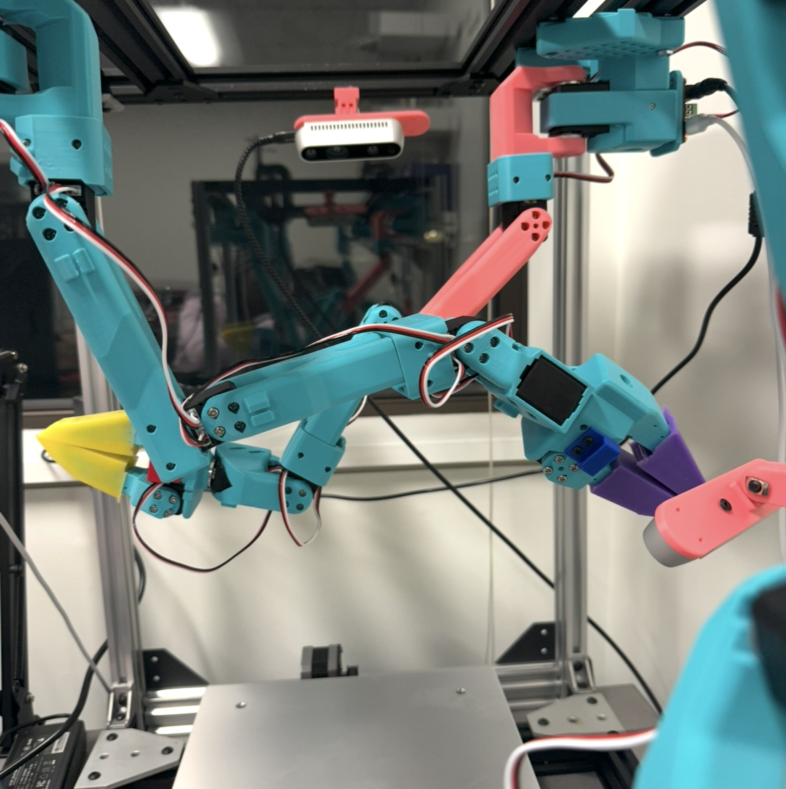
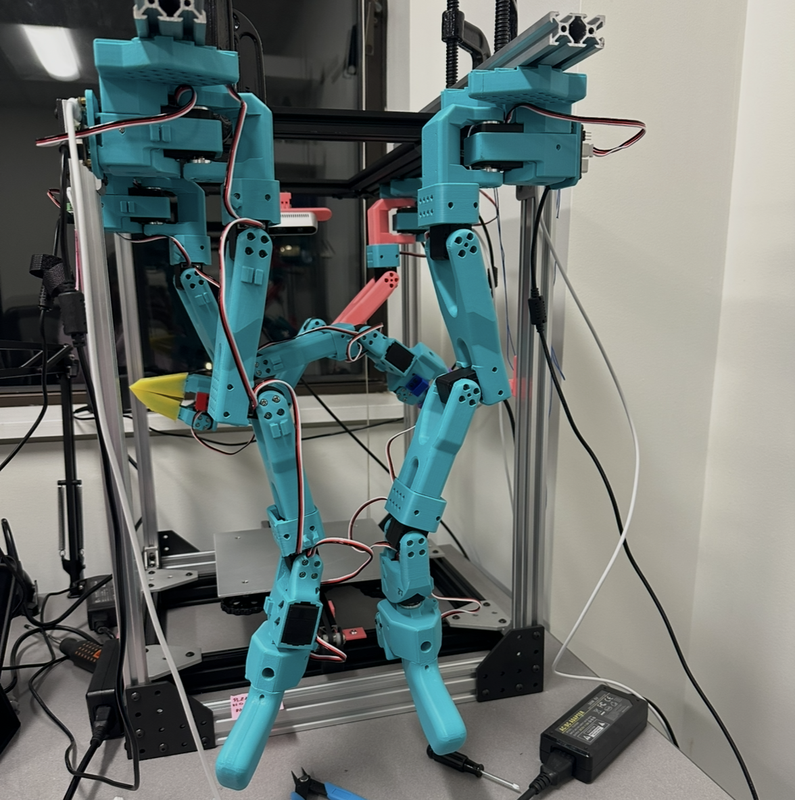
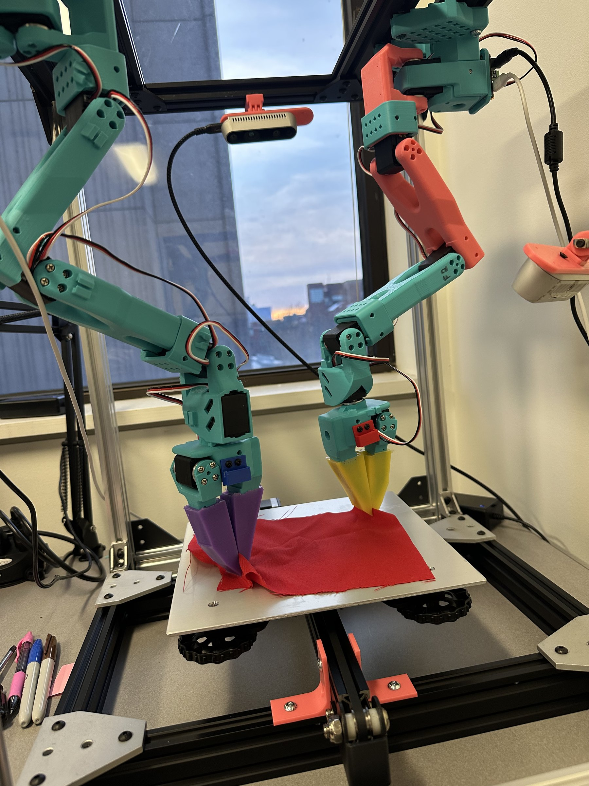
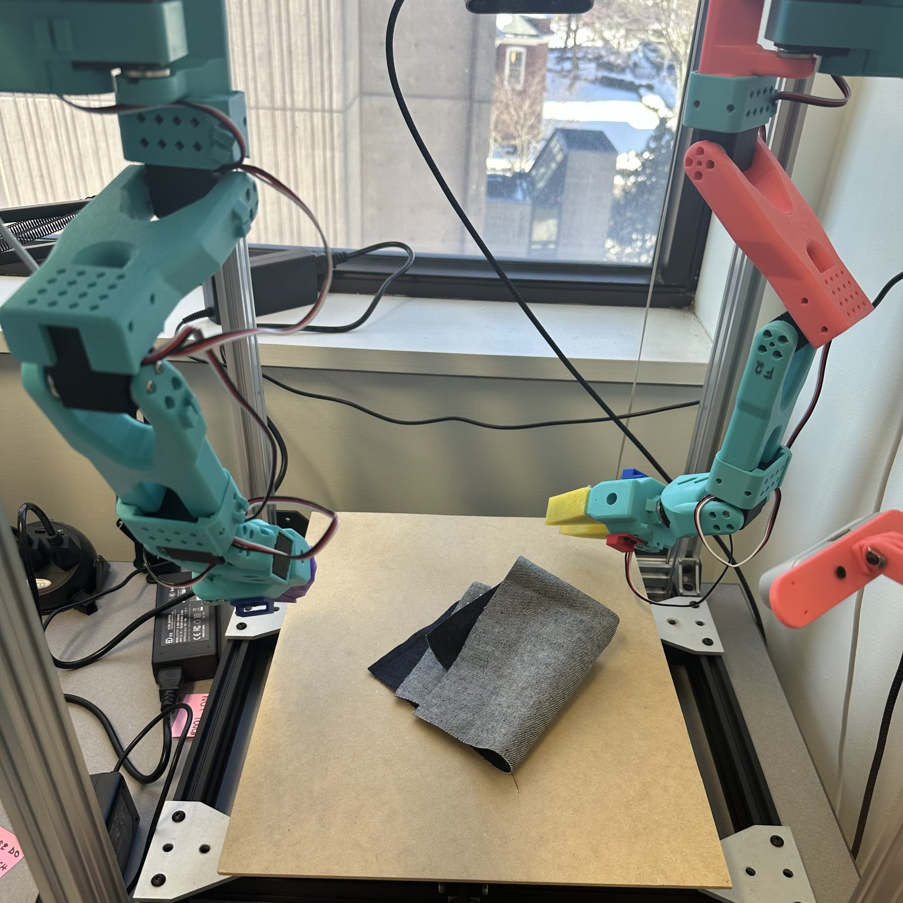

<a href="../" class="back-link">← Back to Home</a>

  <h1>The Sew Unit</h1>
  
A bimanual cloth manipulation platform I designed and built from scratch in grad school. Custom aluminum extrusion frame, two inverted SO-101 arms, ROS2/MoveIt motion planning, and a leader-follower teleoperation system for data collection.

  

    
  

  

    
  

---

## Hardware

<ul class="spec-list">
  <li><strong>Arms:</strong> Two SO-101 robot arms (LeRobot platform), mounted inverted on a custom aluminum extrusion frame</li>
  <li><strong>Workspace:</strong> Ender 3 printer bed, flat, rigid, and replaceable</li>
  <li><strong>Servos:</strong> STS/SCS series servo motors, 12 total (6 per arm)</li>
  <li><strong>Controllers:</strong> Unified serial controller managing both arms over a single bus, built after two independent controllers kept causing port conflicts</li>
</ul>

  

    <video autoplay muted loop playsinline>
      <source src="../assets/videos/sew-unit-frame-spin.mp4" type="video/mp4">
    </video>
    
Custom aluminum extrusion frame — CAD model.

  

  

    <video autoplay muted loop playsinline>
      <source src="../assets/videos/sew-unit-cad-spin.mp4" type="video/mp4">
    </video>
    
Full sew unit with both arms — CAD model spin.

  

---

## Motion Planning & Digital Twin

ROS2 and MoveIt with custom URDF configurations. The inverted mounting orientation required reworking joint limits and gravity compensation; small sign errors in the URDF produce impossible trajectories. The same trajectory recorded via teleoperation can be played back on the real robot and verified against its digital twin.

  

    <video autoplay muted loop playsinline>
      <source src="../assets/videos/sew-unit-mirror-bimanual.mp4" type="video/mp4">
    </video>
    
Real robot executing a recorded bimanual trajectory.

  

  

    <video autoplay muted loop playsinline>
      <source src="../assets/videos/sew-unit-digital-twin.mp4" type="video/mp4">
    </video>
    
Digital twin — the same trajectory in simulation.

  

---

## Teleoperation & Data Collection

The primary data collection method is leader-follower teleoperation. The leader arms share the same morphology as the follower arms, so joint angles map directly with no IK guessing. What you do with the leader is exactly what the follower does.

  <video autoplay muted loop playsinline>
    <source src="../assets/videos/sew-unit-teleop-leader.mp4" type="video/mp4">
  </video>
  
Leader arm teleoperation — operator moves the leader, follower mirrors exactly.

  

    
    
Both arms pinching red cloth — silicone gripper tips visible.

  

  

    
    
Result after a teleoperated cloth fold — denim on the workspace.

  

---

## What I Learned

  
<strong>Inverted mounting is not trivial.</strong> Gravity compensation and joint limits all flip. Small sign errors cause the planner to propose impossible trajectories. Found this out through hours of debugging URDF transforms.

  
<strong>Servo calibration across 12 motors takes days.</strong> EEPROM corruption on one motor requires systematic bus isolation to diagnose without taking everything apart. I built tooling to scan individual motors on the live bus.

  
<strong>The unified controller was born from frustration.</strong> Two independent serial controllers caused port conflicts and timing issues. Merging them onto a single bus with shared timing fixed both problems and simplified the data pipeline.

---

<a href="../" class="back-link">← Back to Home</a>
